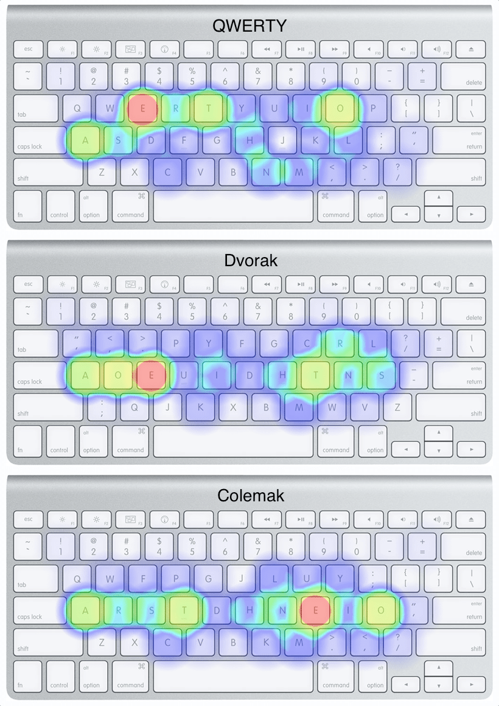
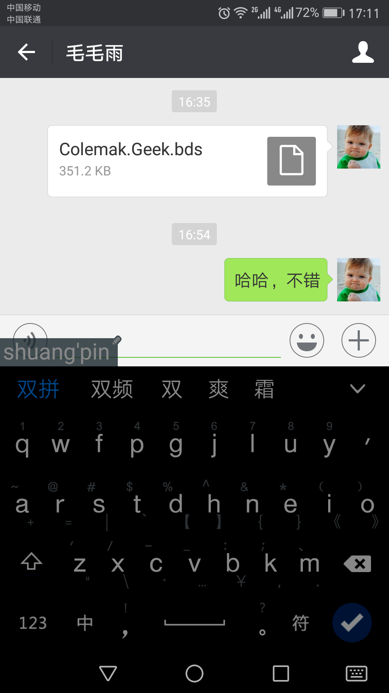

Colemak
=======

Colemak 键盘布局
-------------------------------

AutoHotKey 工具，把标准的Qwerty键盘布局映射成Colemak键盘布局，使用这个脚本 [qwerty-colemak.ahk](qwerty-colemak.ahk)

自由双拼
-------

* Mac IMKQIM 输入法 flexible 双拼配置

    [flexible-IMKQIM.txt](flexible-IMKQIM.txt)

* Windows GooglePinyin 输入法 flexible 双拼配置

    [flexible-GooglePinyin.txt](flexible-GooglePinyin.txt)

* Andriod/iOS Baidu 输入法 flexible 双拼配置

!!! 先使用 https://github.com/arstd/BaiduIME-Skin-Colemak-Geek 这个皮肤

    [flexible-BaiduIME.txt](flexible-BaiduIME.txt)

    
